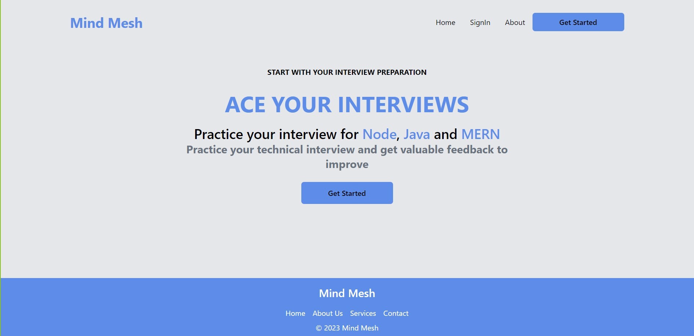
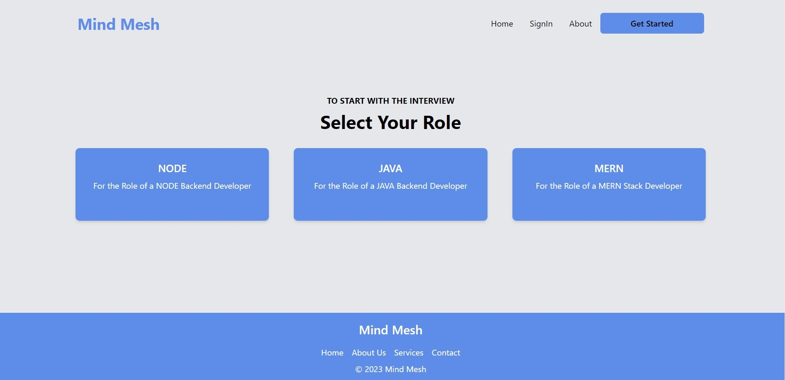

# MindMesh

Mock Interview Simulator with AI-Powered Feedback

## Introduction
In today's rapidly evolving job market, finding the right talent or securing your dream job can be a daunting task. Traditional interview methods often fall short in assessing a candidate's true potential, leading to missed opportunities and costly hiring mistakes. AI-Powered Interviews aims to bridge this gap by leveraging state-of-the-art AI technologies to create a more efficient, unbiased, and insightful interview experience for all parties involved.

MindMesh is an interview preparation tool that provides AI feedback on your mock interviews.

## Tech Stack
- Java
- React
- TypeScript
- JavaScript
- HTML
- Tailwind CSS

## Authors

- [@Utkarash33](https://github.com/Utkarash33)
- [@Biswajit2595](https://github.com/Biswajit2595)
- [@sudharshan2151](https://github.com/sudharshan2151)
- [@kishanjalan11](https://github.com/kishanjalan11)
